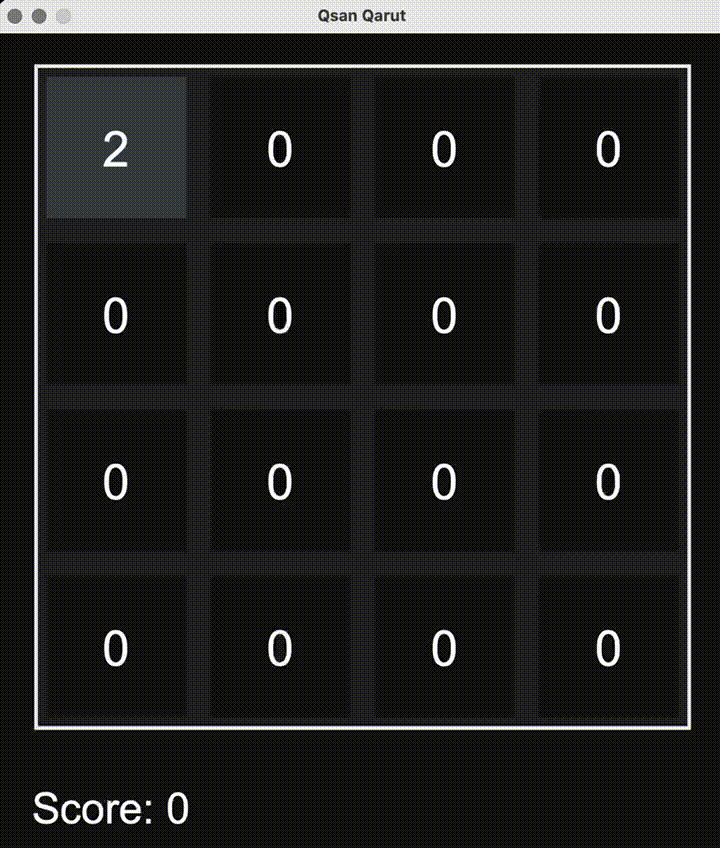

# Qsan Qarut | 2048
## Description
* Type - Desktop Application (with Command Line comments)
* Technology - Python

2048 is a single-player sliding block puzzle game designed by Italian web developer Gabriele Cirulli. The game’s objective is to slide numbered tiles on a grid to combine them to create a tile with the number 2048. However, one can continue to play the game after reaching the goal, creating tiles with larger numbers.

This is an implementation of 2048 game, which will work for any $N \times N$ grid.

## Prerequisites
* Python
* NumPy
* Tkinter

## Usage

```
python3 game.py
```
*Note: to change the size* $N$ *of the grid find it in `controller.py` file*

## Structure
The application is created using the MVC (Model - View - Controller) pattern.


* **[View](view.py)** is the GUI (Graphical User Interface). That is everything you see on your screen is the View part of the application. It not only demonstrates you the game but also helps to send some notification to controller to interact with the model.
* **[Model](model.py)** is the core of the application. It is responsible for all the calculations. All the game's data is stored in this file. Just to make it clear, this part has nothing to do with what you see on your screen (styles and colors).
* **[Controller](game.py)** is the *communication* of Model and View. For example, when you start a new game (i.e. pressing a button on your screen) the View tells the Controller that a button was pressed. And then the Controller makes all the necessary changes in the model. And vice-versa: when the Model changes, the Controller tells the View what it should change on the screen.

## Data Structures
As the application works with MVC pattern, the following classes were created to make the development easier and more clear:

### Model
The Model has a *Model* and a *Game* classes. For this particular application the *Model* class is actually unnecessary because this is only a single-game application, so any "session" will contain just **one** instance of a game and nothing else, but it was not deleted for probable future improvements and new features.

Initialization of Game Class:

```
class Game():
	def __init__(self, N):
		self.grid = N
		self.score = 0
		self.is_finished = False
		self.is_won = False
		self.set_board()
```

As you can see a single game has the property of `grid` which is the $N$. It also stores the `score`, i.e. the sum of all numbers on the field. Next, `is_finished` property is for cases when user looses the game, and the `is_won` property indicates if you've reached the number 2048.

Setting the board. It initializes a $N \times N$ matrix with zeros and then using the `add_num` function it adds a number in a random position.

```
	def set_board(self):
		self.board = np.zeros((self.grid, self.grid), dtype=int)
		self.add_num()
		
	def add_num(self):
		if 0 in self.board:
			i, j = self.get_random_position()
			self.board[i][j] = np.random.choice([2, 4])
```

When making a move, a function `make_move` is called. It contains a `move` argument which determine the direction of the movement. The direction is needed for `stack` function to change the matrix correctly. After that, the score is updated.

*Note: the conditions if a move could be made are checked in the `stack` function which is also responsible for shifting the numbers in correct direction.*

```
	def make_move(self, move):
		self.stack(move)
		self.update_score()
```

The `stack` function checks the board line by line. Firstly, it gets rid of all zeros in a given line and then while iterating it checks if the next and current numbers are the same - if so, it doubles one of them and make the other one zero. After that, it removes all the zeros one more time and then adds zeros at the end or beginning (depends on the direction) to make the size of the array (line) be the same as the grid. Also, this function has a moving flag `is_moved`. It captures if any move was done to clarify if that move can be made. If no changes were registered then the move won't be made. 
Otherwise, it also adds a new number on the filed (2 or 4)

```
	is_moved = False
	# Dzax
	if move == 'l':
		for i, line in enumerate(self.board):
			line = line[line != 0]
			p = 0
			while p < len(line) - 1 and len(line) > 1:
				if line[p] == line[p + 1]:
					line[p] *= 2
					line[p + 1] = 0
				p += 1
			line = line[line != 0]
			line = np.insert(line, len(line), [ 0 for _ in range(self.grid - len(line)) ])
			if not np.array_equal(self.board[i], line):
				self.board[i] = line
				is_moved = True
		if is_moved:
			self.add_num()
```

And after every move the app checks if the game is over. If no moves are available the the game stops and the application is no longer waiting for commands from the keyboard.

### View
The View section is quite simple. It was created with Tkinter. At the very beginning a window is initialised with the size of $600 \times 665$ (the height is greater for a bottom bar with the height of $65$). Also all the necessary labels, buttons are initialised and the properties of the window are set:

```
class View():
	def __init__(self):
		self.window = tk.Tk()
		self.window.title("Qsan Qarut")
		self.window.geometry('600x665')
		self.window.resizable(False, False)
		self.window.configure(bg='#121212')
		self.score_label = Label()
		self.finish_label = Label(self.window, text="Game Over", font=('Arial 35'), fg='white', bg='#121212')
		self.new_game_button = Button()

		self.main_canvas = self.set_main_canvas()
		self.game_canvas = self.set_game_canvas()
```

It uses two canvases - the main canvas for the while window and also a one for the game-field. That's pretty much it for the View part.

### Controller
Controller has a `Controller` class. It has the property of the grid size: `N = 4`. Also, it has the instances of `Model` and `View` classes which are the objects used for the game.

```
class Controller():
	def __init__(self):
		self.model = m.Model(N)
		self.view = v.View()
```

While initializing we should prepare the View for future work:

```
	spacing = 20
	self.cells = np.empty((N, N), dtype=dict)

	for i in range(N):
		for j in range(N):
			frame_cell = tk.Frame(self.view.game_canvas, bg=colors[self.model.game.board[i][j]], width=(600-2*spacing-(N+1)*spacing)/N, height=(600-2*spacing-(N+1)*spacing)/N)
			frame_cell.grid(row=i, column=j, padx=spacing/2, pady=spacing/2)
			cell_number = tk.Label(self.view.game_canvas, bg=colors[self.model.game.board[i][j]], fg='white', text=str(self.model.game.board[i][j]), font=('Arial 40'))
			cell_data = { "frame": frame_cell, "number": cell_number }
 
			cell_number.grid(row=i, column=j)
			self.cells[i][j] = cell_data
```

`cells` variable represents all the "cards" on the game-filed which will be changed during the game. So Controller sets all the squares on the field the correct numbers and colors according to board in the Model.

Also there is an `update_view` function which keeps the GUI up-to-date as the model changes and also checks if the game is finished:

```
	def update_view(self, event):
		self.view.score_label["text"] = "Score: " + str(self.model.game.score)

		for i in range(N):
			for j in range(N):
				self.cells[i][j]["frame"]["bg"] = colors[self.model.game.board[i][j]]
				self.cells[i][j]["number"]["bg"] = colors[self.model.game.board[i][j]]
				self.cells[i][j]["number"]["text"] = str(self.model.game.board[i][j])

		if self.model.game.is_finished:
			self.finish_game()

		if self.model.game.is_won:
			self.win_game()
```

So, the `controller` object is created, `model` and `view` as well. And then the app starts capturing if any key is pressed on the keyboard to interact:

```
controller = Controller()
model = controller.model
view = controller.view

view.window.bind('<Left>', model.game.left_arrow)
view.window.bind('<Left>', controller.update_view, add='+')

view.window.bind('<Right>', model.game.right_arrow)
view.window.bind('<Right>', controller.update_view, add='+')

view.window.bind('<Up>', model.game.up_arrow)
view.window.bind('<Up>', controller.update_view, add='+')

view.window.bind('<Down>', model.game.down_arrow)
view.window.bind('<Down>', controller.update_view, add='+')
```

## Results


